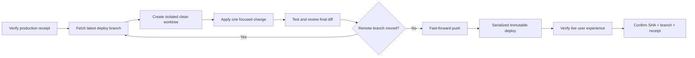

<div align="center">

# 🛡️ AGENTS.md

### Production Safety Rules for AI Coding Agents

**A production-first operating standard for autonomous coding agents, parallel sessions, and deployment harnesses.**

[](#the-production-first-principle)
[](#the-safety-gate)
[](#built-for-parallel-work)
[](#choose-your-rulebook)

*Move fast without moving production backwards.*

</div>

---

## Why this exists

AI coding agents can ship quickly—but speed becomes dangerous when several sessions work at once, local checkouts drift behind production, or a successful deployment silently restores an older interface.

This repository provides a practical safety floor for agents operating on real systems. Its rules are designed to prevent:

- accidental rollback of newer production behavior;
- one agent overwriting another agent's completed work;
- stale or dirty workspaces becoming deployment sources;
- unverified deployments being reported as complete;
- prompt injection, secret exposure, and unsafe destructive operations;
- green CI checks masking a broken user-visible production experience.

> [!IMPORTANT]
> A build that passes is not necessarily safe to deploy. A deployment that succeeds is not necessarily correct in production.

## The production-first principle

Once a change has been successfully deployed, the current production state becomes protected behavior. Local code is never assumed to be newer, safer, or more authoritative.

Every new change must begin from the latest verified deploy branch, preserve any production-only hotfix, and pass both a forward-regression gate and an anti-rollback gate.



## Choose your rulebook

| Rulebook | Best for | Focus |
|---|---|---|
| **[Universal AI Agent Rules](./UNIVERSAL_AI_AGENT_PRODUCTION_RULES.md)** | Any coding agent, orchestrator, or deployment system | Vendor-neutral production safety baseline |
| **[Codex Rules](./CODEX_GLOBAL_PRODUCTION_RULES.md)** | OpenAI Codex sessions, worktrees, and automations | Codex-specific parallelism, authorization, and deployment discipline |
| **[DeepSeek Harness Rules](./DEEPSEEK_HARNESS_GLOBAL_PRODUCTION_RULES.md)** | DeepSeek models operated through a controlled harness | Controller enforcement, capability separation, and audit events |

### Recommended adoption

1. Start with the **Universal** rules as your organization-wide minimum.
2. Add the matching agent-specific rulebook for the runtime you use.
3. Place stricter project-specific instructions in each repository.
4. Never allow project instructions to weaken the global production-safety floor.

## The safety gate

Before any production mutation, an agent must establish all of the following:

```text
CURRENT PRODUCTION RECEIPT
        == intended deployed commit
        == latest deploy-branch head
        ⊆ candidate commit ancestry
```

The candidate must contain the latest fetched deploy-branch commit, introduce only the requested change and necessary support work, and be deployed from an immutable commit or artifact. If those conditions cannot be proven, deployment stops.

### Non-negotiable guarantees

- **No stale deployment:** fetch and re-check immediately before push and deploy.
- **No force push:** deploy branches advance by fast-forward only.
- **No dirty deployment:** replay approved changes onto a clean, current worktree.
- **No silent rollback:** rollback is an explicit, recorded emergency operation.
- **No “workflow succeeded” shortcut:** verify the exact live route and user context.
- **No mutable artifact ambiguity:** record the immutable deployed SHA or release receipt.

## Built for parallel work

Multiple agents can work concurrently without becoming multiple uncontrolled deployment writers.

Each session uses an isolated worktree based on the newest deploy branch. Production mutation is serialized, the remote head is checked again at the last responsible moment, and stale candidates are rejected rather than pushed over newer work.

| Risk | Required control |
|---|---|
| Two sessions edit simultaneously | Separate clean worktrees |
| Another session pushes first | Fetch, rebase or replay, then retest |
| A deploy starts from stale code | Latest-head ancestry check |
| Deployments overlap | Serialized latest-only deployment path |
| Runtime differs from Git | Immutable production receipt and reconciliation |

## Defense in depth

These rulebooks cover more than Git history:

- instruction precedence and untrusted-content handling;
- least privilege and controller-side enforcement;
- secrets and sensitive-data protection;
- destructive filesystem and database operations;
- migration, dependency, build, and supply-chain safety;
- trusted deployment runners and authorization boundaries;
- post-deployment browser and device verification;
- auditable completion reports and mandatory stop conditions.

## Quick start

Copy the universal rulebook into your global agent configuration, then add the runtime-specific profile where applicable.

```bash
git clone https://github.com/minflamingo/AGENTS.md.git
cd AGENTS.md
```

For a repository-level `AGENTS.md`, reference or incorporate the relevant rules and add only stricter project details such as:

- deploy branch and workflow;
- production path and immutable receipt location;
- required self-hosted runner labels;
- test and verification commands;
- authenticated live routes and supported viewports;
- project-specific stop conditions.

> [!CAUTION]
> Do not copy rules blindly into an automation and assume the job is done. Enforcement belongs in the deployment controller, branch protections, runner policy, and immutable release process—not only in prompts.

## What “done” means

A production task is complete only when the report separates and proves:

1. **Changed** — the focused source diff is complete.
2. **Tested** — relevant checks passed on the final candidate.
3. **Pushed** — the deploy branch points to the intended commit.
4. **Deployed** — the production receipt identifies that same commit.
5. **Verified** — the real user-visible experience works in its actual context.

## Contributing

Improvements are welcome when they make the rules clearer, more enforceable, or safer across real deployment systems. Proposed changes should preserve the production-first floor and explain the failure mode they address.

---

<div align="center">

### Protect what is already working. Ship only what moves it forward.

**Production first · Fast-forward only · Verify the real experience**

</div>
