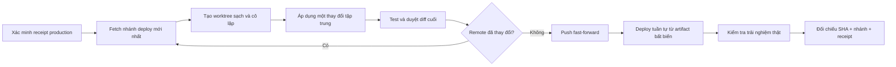

<div align="center">

# 🛡️ AGENTS.md

### Tiêu chuẩn an toàn Production dành cho AI Coding Agent

**Bộ quy tắc vận hành theo nguyên tắc production-first dành cho agent tự chủ, nhiều phiên song song và hệ thống triển khai.**

[English](./README.md) · [**Tiếng Việt**](./README.vi.md) · [简体中文](./README.zh-CN.md)

[](#nguyên-tắc-production-first)
[](#cổng-an-toàn)
[](#an-toàn-khi-làm-việc-song-song)
[](#chọn-bộ-quy-tắc)

### *Production là trạng thái được bảo vệ—không chỉ là một máy chủ.*

Làm nhanh. Giữ nguyên thứ đang hoạt động. Chứng minh thứ đã đưa lên.

</div>

---

**[Lý do](#vì-sao-repository-này-tồn-tại)** · **[Nguyên tắc](#nguyên-tắc-production-first)** · **[Bộ quy tắc](#chọn-bộ-quy-tắc)** · **[Cổng an toàn](#cổng-an-toàn)** · **[Song song](#an-toàn-khi-làm-việc-song-song)** · **[Bắt đầu](#bắt-đầu-nhanh)**

---

## Vì sao repository này tồn tại

AI coding agent có thể đưa thay đổi lên rất nhanh. Nhưng tốc độ trở nên nguy hiểm khi nhiều phiên cùng làm việc, mã nguồn local tụt sau production hoặc một lần triển khai “thành công” lại âm thầm khôi phục giao diện cũ.

Repository này đặt ra một mức an toàn tối thiểu, thực dụng cho agent làm việc trên hệ thống thật. Các quy tắc giúp ngăn chặn:

- vô tình kéo lùi hành vi mới hơn trên production;
- một agent ghi đè thành quả của agent khác;
- workspace cũ hoặc đang bẩn trở thành nguồn triển khai;
- báo cáo hoàn tất khi production chưa được kiểm chứng;
- prompt injection, lộ bí mật và thao tác phá huỷ không an toàn;
- CI xanh nhưng trải nghiệm thật của người dùng lại hỏng.

> [!IMPORTANT]
> Build thành công chưa có nghĩa là an toàn để triển khai. Deploy thành công chưa có nghĩa là production đang đúng.

| BẢO VỆ | CÔ LẬP | CHỨNG MINH |
|:---:|:---:|:---:|
| Giữ nguyên hành vi production đang tốt | Mỗi phiên dùng một worktree sạch | SHA, nhánh, artifact, receipt và UI thật phải khớp |
| **Không rollback ngoài ý muốn** | **Không ghi đè chéo phiên** | **Không tuyên bố “xong” khi chưa xác minh** |

## Nguyên tắc production-first

Sau khi một thay đổi được triển khai thành công, trạng thái production hiện tại trở thành hành vi được bảo vệ. Không bao giờ mặc định code local mới hơn, sạch hơn hoặc đáng tin cậy hơn production.

Mọi thay đổi mới phải bắt đầu từ nhánh triển khai mới nhất đã được xác minh, bảo toàn mọi hotfix chỉ có trên production và vượt qua cả cổng chống mất tính năng lẫn cổng chống rollback.



## Chọn bộ quy tắc

| Bộ quy tắc | Phù hợp với | Trọng tâm |
|---|---|---|
| **[Universal AI Agent Rules](./UNIVERSAL_AI_AGENT_PRODUCTION_RULES.md)** | Mọi coding agent, orchestrator hoặc hệ thống triển khai | Chuẩn an toàn production không phụ thuộc nhà cung cấp |
| **[Codex Rules](./CODEX_GLOBAL_PRODUCTION_RULES.md)** | Phiên Codex, worktree và automation | Làm việc song song, phân quyền và kỷ luật triển khai dành riêng cho Codex |
| **[DeepSeek Harness Rules](./DEEPSEEK_HARNESS_GLOBAL_PRODUCTION_RULES.md)** | Mô hình DeepSeek vận hành qua harness có kiểm soát | Kiểm soát ở controller, tách capability và audit event |

### Cách áp dụng khuyến nghị

1. Dùng bộ **Universal** làm chuẩn tối thiểu cho toàn tổ chức.
2. Thêm bộ quy tắc tương ứng với runtime đang sử dụng.
3. Đặt hướng dẫn nghiêm ngặt hơn theo từng dự án trong repository đó.
4. Không cho phép quy tắc cấp dự án làm yếu đi mức an toàn toàn cục.

## Cổng an toàn

Trước mọi thao tác thay đổi production, agent phải chứng minh đầy đủ:

```text
RECEIPT PRODUCTION HIỆN TẠI
        == commit dự kiến triển khai
        == HEAD mới nhất của nhánh deploy
        ⊆ lịch sử tổ tiên của commit ứng viên
```

Commit ứng viên phải chứa commit mới nhất đã fetch từ nhánh triển khai, chỉ gồm thay đổi được yêu cầu cùng phần hỗ trợ bắt buộc và phải được triển khai từ commit hoặc artifact bất biến. Không chứng minh được thì phải dừng deploy.

> **Quy tắc rất đơn giản:** còn mơ hồ thì dừng thay đổi; có bằng chứng mới tiếp tục.

### Các bảo đảm không thể thương lượng

- **Không deploy mã cũ:** fetch và kiểm tra lại ngay trước push và deploy.
- **Không force push:** nhánh deploy chỉ tiến lên bằng fast-forward.
- **Không deploy workspace bẩn:** đưa đúng thay đổi được duyệt lên một worktree sạch và mới nhất.
- **Không rollback âm thầm:** rollback là thao tác khẩn cấp, rõ ràng và có ghi nhận.
- **Không lấy “workflow xanh” làm kết luận:** kiểm tra đúng route và đúng ngữ cảnh người dùng.
- **Không dùng artifact mơ hồ:** ghi lại SHA hoặc receipt bất biến đã triển khai.

## An toàn khi làm việc song song

Nhiều agent có thể chạy đồng thời mà không biến thành nhiều tác nhân cùng ghi lên production một cách mất kiểm soát.

Mỗi phiên dùng một worktree cô lập được tạo từ nhánh deploy mới nhất. Thao tác production phải chạy tuần tự, remote HEAD được kiểm tra lại ở thời điểm cuối cùng và ứng viên đã cũ phải bị từ chối thay vì ghi đè công việc mới.

| Rủi ro | Kiểm soát bắt buộc |
|---|---|
| Hai phiên cùng sửa code | Worktree sạch riêng biệt |
| Phiên khác push trước | Fetch, rebase hoặc áp lại thay đổi rồi test lại |
| Deploy bắt đầu từ code cũ | Kiểm tra quan hệ tổ tiên với HEAD mới nhất |
| Nhiều deploy chồng nhau | Luồng deploy tuần tự, chỉ nhận bản mới nhất |
| Runtime khác Git | Receipt production bất biến và quy trình đối chiếu |

## Phòng thủ nhiều lớp

Các bộ quy tắc không chỉ bảo vệ lịch sử Git mà còn bao phủ:

- thứ tự ưu tiên chỉ dẫn và xử lý nội dung không đáng tin;
- đặc quyền tối thiểu và kiểm soát phía controller;
- bí mật và dữ liệu nhạy cảm;
- thao tác phá huỷ trên filesystem và cơ sở dữ liệu;
- migration, dependency, build và chuỗi cung ứng;
- deployment runner đáng tin và ranh giới phân quyền;
- kiểm tra trên trình duyệt, thiết bị và ngữ cảnh thật sau deploy;
- báo cáo hoàn tất có thể audit và điều kiện bắt buộc phải dừng.

## Bắt đầu nhanh

Đưa bộ Universal vào cấu hình agent toàn cục, sau đó thêm profile dành riêng cho runtime nếu phù hợp.

```bash
git clone https://github.com/minflamingo/AGENTS.md.git
cd AGENTS.md
```

<details>
<summary><strong>Checklist áp dụng cho production</strong></summary>

- [ ] Khai báo nhánh deploy và nguồn sự thật.
- [ ] Ghi lại SHA production hoặc release receipt bất biến.
- [ ] Bắt buộc mỗi phiên dùng worktree sạch, cô lập.
- [ ] Bắt buộc kiểm tra latest-head ancestry và chỉ cho fast-forward.
- [ ] Chạy tuần tự mọi thay đổi production và từ chối artifact cũ.
- [ ] Kiểm tra route thật trong phiên đăng nhập sau mỗi lần deploy.
- [ ] Báo cáo riêng: đã sửa, đã test, đã push, đã deploy và đã xác minh.

</details>

Với `AGENTS.md` cấp repository, hãy tham chiếu hoặc tích hợp bộ quy tắc phù hợp và chỉ bổ sung các chi tiết nghiêm ngặt hơn như nhánh deploy, workflow, production path, receipt, nhãn runner, lệnh test, route cần kiểm tra và điều kiện dừng.

> [!CAUTION]
> Không nên chỉ chép quy tắc vào automation rồi coi như đã an toàn. Cơ chế thực thi phải nằm trong deployment controller, branch protection, runner policy và quy trình release bất biến, không chỉ nằm trong prompt.

## Khi nào được gọi là “xong”

Một công việc production chỉ hoàn tất khi báo cáo tách riêng và chứng minh được:

1. **Đã sửa** — diff nguồn tập trung đã hoàn tất.
2. **Đã test** — các kiểm tra liên quan đã chạy trên ứng viên cuối.
3. **Đã push** — nhánh deploy đang trỏ đến đúng commit.
4. **Đã deploy** — receipt production xác nhận cùng commit đó.
5. **Đã xác minh** — trải nghiệm thật hoạt động trong đúng ngữ cảnh người dùng.

## Đóng góp

Mọi cải tiến giúp quy tắc rõ ràng hơn, có thể thực thi tốt hơn hoặc an toàn hơn trên hệ thống thật đều được chào đón. Đề xuất thay đổi phải giữ nguyên mức an toàn production-first và nêu rõ dạng sự cố mà thay đổi đó giải quyết.

---

<div align="center">

### Bảo vệ thứ đang hoạt động. Chỉ đưa lên những gì giúp nó tiến về phía trước.

**Production first · Chỉ fast-forward · Kiểm tra trải nghiệm thật**

[Read in English](./README.md) · [Đọc bằng tiếng Việt](./README.vi.md) · [阅读简体中文](./README.zh-CN.md)

</div>
