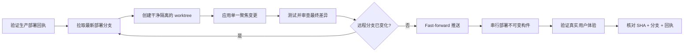

<div align="center">

# 🛡️ AGENTS.md

### AI 编程智能体生产安全标准

**一套面向自主智能体、并行会话与部署执行框架的 production-first 运行规范。**

[English](./README.md) · [Tiếng Việt](./README.vi.md) · [**简体中文**](./README.zh-CN.md)

[](#production-first-原则)
[](#安全门)
[](#为并行协作而设计)
[](#选择规则手册)

### *生产环境是一种受保护的状态，而不只是一台服务器。*

快速推进，保留有效成果，并证明真正上线的内容。

</div>

---

**[缘起](#为什么需要这个项目)** · **[原则](#production-first-原则)** · **[规则手册](#选择规则手册)** · **[安全门](#安全门)** · **[并行协作](#为并行协作而设计)** · **[快速开始](#快速开始)**

---

## 为什么需要这个项目

AI 编程智能体能够快速交付，但当多个会话同时工作、本地检出落后于生产环境，或一次“成功”的部署悄悄恢复了旧版界面时，速度就会变成风险。

本仓库为在真实系统上工作的智能体提供一套务实的最低安全标准，用于防止：

- 意外回滚生产环境中的新功能；
- 一个智能体覆盖另一个智能体已经完成的工作；
- 陈旧或脏工作区成为部署来源；
- 未验证生产结果就宣称任务完成；
- 提示注入、密钥泄漏及不安全的破坏性操作；
- CI 全绿，但用户实际看到的生产体验已经损坏。

> [!IMPORTANT]
> 构建通过并不代表可以安全部署；部署成功也不代表生产结果正确。

| 保护 | 隔离 | 证明 |
|:---:|:---:|:---:|
| 保留生产环境中已验证的行为 | 每个会话使用独立的干净 worktree | 对齐分支、构件、回执与真实界面 |
| **杜绝意外回滚** | **杜绝会话互相覆盖** | **杜绝未经验证的“完成”** |

## Production-first 原则

一项变更成功部署后，当前生产状态即成为受保护行为。绝不能假定本地代码比生产环境更新、更干净或更可靠。

每项新变更都必须从最新且已验证的部署分支开始，保留仅存在于生产环境的热修复，并同时通过前向回归门和防回滚门。



## 选择规则手册

| 规则手册 | 适用场景 | 核心重点 |
|---|---|---|
| **[Universal AI Agent Rules](./UNIVERSAL_AI_AGENT_PRODUCTION_RULES.md)** | 任意编程智能体、编排器或部署系统 | 与供应商无关的生产安全基线 |
| **[Codex Rules](./CODEX_GLOBAL_PRODUCTION_RULES.md)** | OpenAI Codex 会话、worktree 与自动化任务 | Codex 专用的并行协作、授权和部署纪律 |
| **[DeepSeek Harness Rules](./DEEPSEEK_HARNESS_GLOBAL_PRODUCTION_RULES.md)** | 通过受控 harness 运行的 DeepSeek 模型 | 控制器强制执行、能力隔离与审计事件 |

### 推荐采用方式

1. 以 **Universal** 规则作为组织级最低标准。
2. 根据所用运行环境加入对应的智能体专用规则。
3. 在各仓库内加入更严格的项目级指令。
4. 任何项目指令都不得削弱全局生产安全底线。

## 安全门

在执行任何生产变更之前，智能体必须证明：

```text
当前生产部署回执
        == 计划部署的提交
        == 部署分支的最新 HEAD
        ⊆ 候选提交的祖先历史
```

候选提交必须包含最新拉取的部署分支提交，只包含用户要求的变更及必要的支持性修改，并且必须从不可变提交或构件部署。无法证明以上条件时，部署必须停止。

> **规则很简单：** 存在不确定性就停止变更；获得证据后才继续。

### 不可妥协的保障

- **不部署陈旧代码：** 在推送和部署前立即重新拉取并检查。
- **不强制推送：** 部署分支只能 fast-forward 前进。
- **不部署脏工作区：** 将获批变更重放到最新的干净 worktree。
- **不静默回滚：** 回滚必须是明确、留痕的紧急操作。
- **不把“工作流成功”当作结论：** 验证准确路由与真实用户上下文。
- **不使用含糊的可变构件：** 记录已部署的不可变 SHA 或发布回执。

## 为并行协作而设计

多个智能体可以同时工作，而不会变成多个不受控的生产写入者。

每个会话都使用基于最新部署分支创建的独立 worktree。生产变更必须串行执行，在最后责任时刻重新检查远程 HEAD，并拒绝陈旧候选，而不是让其覆盖更新的工作。

| 风险 | 必需控制措施 |
|---|---|
| 两个会话同时修改 | 使用独立的干净 worktree |
| 其他会话先完成推送 | 拉取、rebase 或重放变更，然后重新测试 |
| 部署从旧代码开始 | 检查候选与最新 HEAD 的祖先关系 |
| 多次部署互相重叠 | 采用串行、仅最新版本的部署通道 |
| 运行时状态与 Git 不一致 | 使用不可变生产回执并完成对账 |

## 纵深防御

这些规则手册不仅保护 Git 历史，还涵盖：

- 指令优先级与不可信内容处理；
- 最小权限与控制器端强制执行；
- 密钥与敏感数据保护；
- 文件系统和数据库的破坏性操作；
- 迁移、依赖、构建与供应链安全；
- 可信部署 runner 与授权边界；
- 部署后的浏览器、设备和真实上下文验证；
- 可审计的完成报告与强制停止条件。

## 快速开始

将 Universal 规则加入全局智能体配置，然后按需加入运行环境专用规则。

```bash
git clone https://github.com/minflamingo/AGENTS.md.git
cd AGENTS.md
```

<details>
<summary><strong>生产采用检查清单</strong></summary>

- [ ] 明确部署分支和事实来源。
- [ ] 记录生产 SHA 或不可变发布回执。
- [ ] 强制每个会话使用干净隔离的 worktree。
- [ ] 强制检查最新 HEAD 的祖先关系，并仅允许 fast-forward。
- [ ] 串行执行生产变更并拒绝陈旧构件。
- [ ] 每次部署后验证已登录状态下的真实路由。
- [ ] 分别报告已修改、已测试、已推送、已部署和已验证。

</details>

对于仓库级 `AGENTS.md`，应引用或整合适用规则，并仅加入更严格的项目细节，例如部署分支、工作流、生产路径、回执位置、runner 标签、测试命令、需验证的路由及停止条件。

> [!CAUTION]
> 不要只是把规则复制进自动化提示就认为安全已经落实。真正的强制执行必须存在于部署控制器、分支保护、runner 策略和不可变发布流程中，而不能只存在于提示词里。

## “完成”的定义

一项生产任务只有在报告分别证明以下五项后才算完成：

1. **已修改** — 聚焦的源代码差异已经完成。
2. **已测试** — 最终候选已通过相关检查。
3. **已推送** — 部署分支指向预期提交。
4. **已部署** — 生产回执标识同一提交。
5. **已验证** — 真实用户体验在实际上下文中正常工作。

## 参与贡献

欢迎任何能够让规则更清晰、更易强制执行，或在真实部署系统中更安全的改进。提案必须保持 production-first 安全底线，并说明其解决的具体失效模式。

---

<div align="center">

### 保护已经正常运行的成果，只发布推动它继续前进的变更。

**Production first · 仅允许 fast-forward · 验证真实体验**

[Read in English](./README.md) · [Đọc bằng tiếng Việt](./README.vi.md) · [阅读简体中文](./README.zh-CN.md)

</div>
